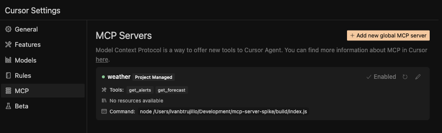
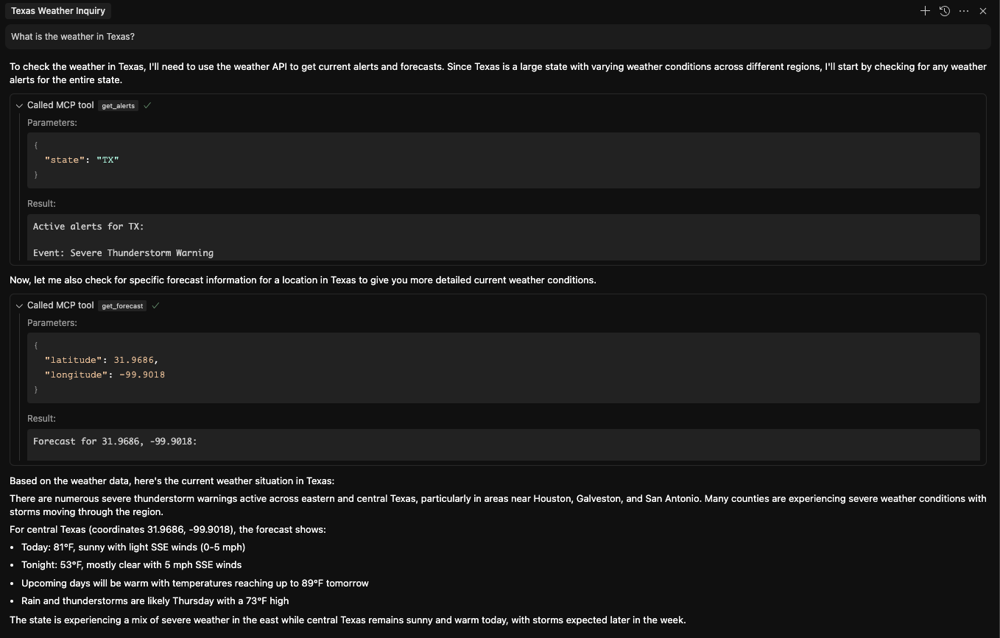

# MCP Server Example

This project is a very basic MCP server ready to be consumed by Cursor or other tools.

Modify index.ts and add any tools you want, or keep the default ones.

Then build the project:

```bash
pnpm run build
```

And run it:

```bash
pnpm run start
```

Now add a .cursor/mcp.json file in your project, and paste the following;

```
{
    "mcpServers":{
        "weather":{
            "command": "node",
            "args": ["[path]/build/index.js"]
        }     
    }
}
```
Replace [path] with the absolute path to this project. Run pwd in the project folder for that. For example, in my case it is:
```
{
    "mcpServers":{
        "weather":{
            "command": "node",
            "args": ["/Users/ivanbtrujillo/Development/mcp-server-spike/build/index.js"]
        }     
    }
}
```
Now go to "Settings" in cursor. You should be able to see the MCP server there. Enable it (click on the top right)


Now go to the chat, switch to Agent mode and select claude-3.7-sonnet as your model.

Type the following: 
```
What is the weather in Texas?
```

It will use the MCP to get first the weather alerts, and then the forecast
Here is an example of how the chat interface looks when querying the weather in Texas:


